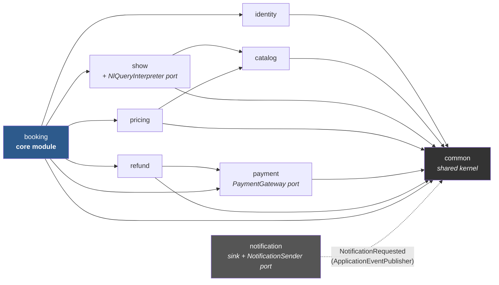
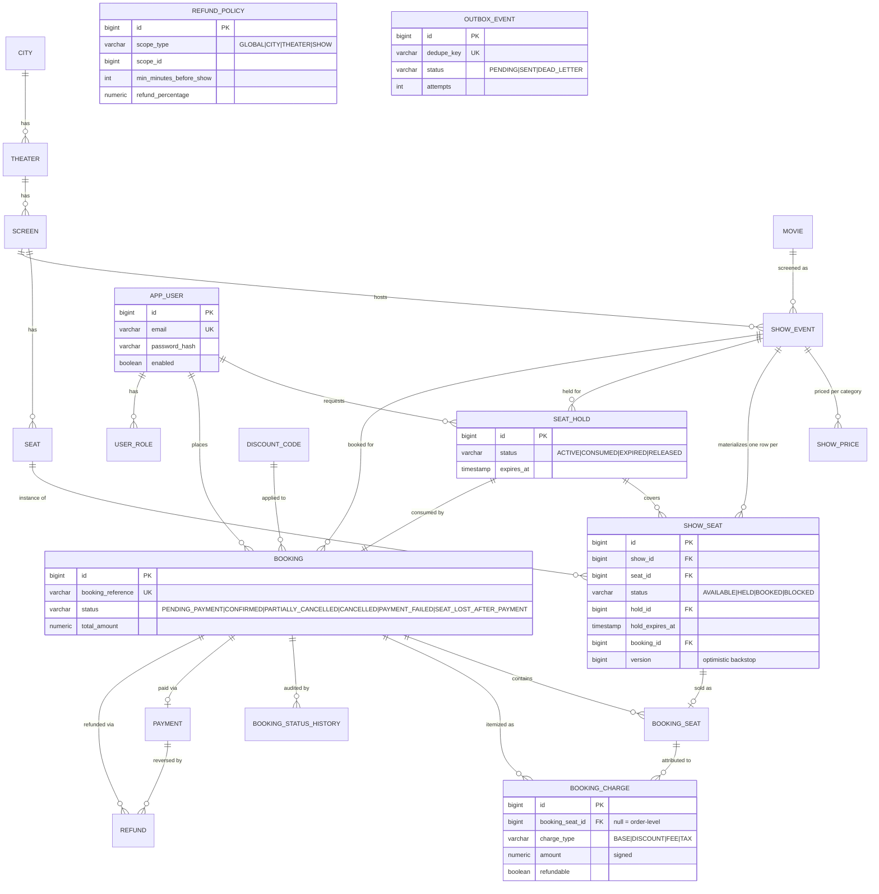
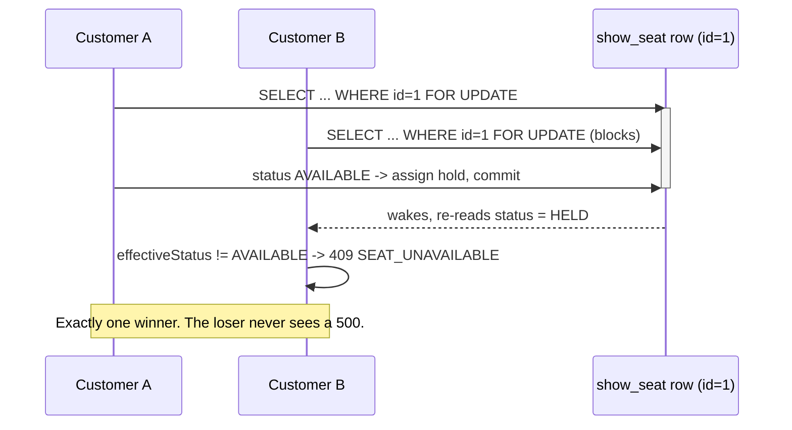
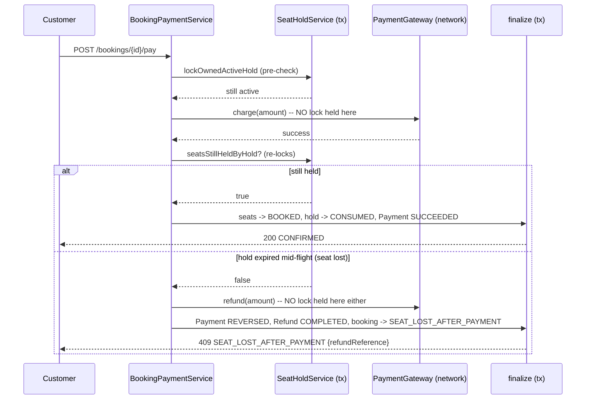

# CineAgent — Architecture

The reasoning behind the decisions in this codebase: what was chosen and why, what was
deliberately rejected, how the concurrency guarantee actually works, the full data model, the
requirements-to-test traceability matrix, and an honest list of known gaps. `README.md` stays a
quick start and feature list; everything that needs justifying lives here.

## Contents

- [What this is, and what it deliberately isn't](#what-this-is-and-what-it-deliberately-isnt)
- [Assumptions and interpretations](#assumptions-and-interpretations)
- [Tech stack and reasoning](#tech-stack-and-reasoning)
- [Module dependency graph](#module-dependency-graph)
- [Data model](#data-model)
- [The concurrency guarantee](#the-concurrency-guarantee)
- [Booking and payment lifecycle](#booking-and-payment-lifecycle)
- [AI-powered features](#ai-powered-features)
- [Requirements traceability matrix](#requirements-traceability-matrix)
- [The AI development workflow](#the-ai-development-workflow)
- [Known gaps](#known-gaps)

## What this is, and what it deliberately isn't

Per the assignment brief, **in scope**: REST APIs for the core flows, persistence, basic
role-based access control, input validation and error handling, and tests for the core flows.
**Explicitly out of scope, by the brief itself**: any UI/frontend, deployment/CI-CD, distributed
systems or microservices, advanced auth (OAuth/SSO/MFA), and production-grade observability. None
of those were attempted.

Within that frame, this submission leans toward breadth: seat-level holds with lazy expiry,
per-category show pricing, discount codes, a payment gateway port with a deterministic mock,
configurable tiered refund policies with pro-rata per-seat refunds, a transactional outbox for
async notifications plus a reminder job and an ETA-based nudge, natural-language show search, and
an admin surface covering the full catalog/show/pricing/refund-policy/seat-blocking/ops
management set the brief calls for.

**Deliberately rejected**, and saying so is itself part of the scoping judgment the brief asks
for: Redis-based locking (without fencing tokens it is *worse* than a DB row lock, which commits
atomically with the data it protects); Kafka or any message broker (the transactional outbox
gives the same at-least-once/exactly-once-production guarantee with far less moving surface);
caching the seat map (actively wrong — it would serve stale availability straight into guaranteed
409s); a general pricing-rule engine (see below); rate limiting, WebSockets, GraphQL, and a
microservice split (none earn their complexity at this scope).

## Assumptions and interpretations

The brief is intentionally open-ended in a few places. Documenting the reasoning here, as asked:

- **"Pricing tiers (regular, premium, weekend)"** conflates two independent axes: seat *category*
  (a property of the physical seat — regular/premium/recliner) and a *temporal surcharge*
  (a property of a specific show's timing). Modelling "weekend" as a third seat category would
  make "a premium seat on a Saturday show" unrepresentable. Instead, `ShowPrice` is per-show,
  per-category — an admin sets a higher `baseAmount` on a Saturday show directly. A separate
  rule-evaluation engine (SpEL, a custom condition DSL) would express the same "weekend
  surcharge" outcome for materially more code and an unsafe admin-facing expression surface, so
  it was deliberately not built.
- **"Book and cancel seats"** (plural, seat-level) is read literally: partial, per-seat
  cancellation is a first-class operation (`POST /bookings/{id}/cancel-seats`), not just
  whole-booking cancellation. This is why `booking_charge` is itemized *per seat*, not just per
  order — a pro-rata refund on one seat of a three-seat booking has to sum over that seat's own
  charge lines, never a recomputation from today's prices.
- **"View booking history"** is satisfied two ways, since the phrase is genuinely ambiguous: a
  paginated list of a customer's own past bookings (`GET /bookings`), and a per-booking lifecycle
  timeline (`GET /bookings/{id}/history`, backed by an append-only `booking_status_history`
  table).
- **Refund policy scope** resolves most-specific-wins (`SHOW > THEATER > CITY > GLOBAL`) rather
  than composing/stacking — a refund policy is read as a single promise to the customer, not a
  set of additive facts the way pricing surcharges are.
- **Idempotency keys** for payment/booking creation were scoped as `ErrorCode` entries
  (`IDEMPOTENCY_KEY_REQUIRED` etc.) but the actual header-based mechanism was cut under the time
  budget — see [Known gaps](#known-gaps) for exactly what protection exists instead.
- **AI features stay optional and degrade gracefully.** Natural-language show search defaults to
  a deterministic keyword parser and only calls a real LLM (Gemini) when explicitly enabled with
  a key, falling back to the deterministic parser on any failure. ETA-based nudges use a flat
  configured travel-time estimate rather than a real maps API. Neither feature is load-bearing
  for grading correctness, and neither requires external credentials to run the full test suite
  or the demo script.

## Tech stack and reasoning

| Choice | Reasoning |
|---|---|
| **Java 25 (LTS) + Spring Boot 4.1** | Current stable at time of writing; using it over a year-old Boot 3.x signals currency and forced an early spike on Boot 4's breaking changes (Jackson 3, Spring Security 7's config DSL) rather than discovering them mid-build. |
| **Maven + committed wrapper** | More universally runnable by a cold reviewer than Gradle; no local Maven install needed. |
| **Spring Data JPA + Flyway, `ddl-auto=validate`** | `ddl-auto=update` hides the schema — and half the concurrency design *lives* in the schema (locking columns, `CHECK` constraints as a second enforcement layer, index rationale). |
| **H2 in-memory, PostgreSQL compatibility mode, as the default profile** | Clone-and-run with zero daemons. The concurrency proof runs on this profile specifically because it's what a reviewer actually launches — a Postgres-only proof would leave the shipped default unproven. |
| **Real embedded Postgres too** (zonky, no Docker) | Proves the production target, not just the demo default. Fails loudly if the binary can't start, rather than silently skipping — an invisible skip is how an unproven guarantee ships; the one sanctioned opt-out is the explicit `-Dpostgres.it.skip=true` flag for a fully offline reviewer. |
| **Feature-sliced package layout**, not `controller/service/repository` | A reviewer skimming the repo for ten minutes should learn the domain decomposition from the package list alone. Strict layering produces a 20-file junk drawer per layer at this project's size. |
| **Spring Security + stateless JWT (HS256), BCrypt** | HTTP Basic reads as "didn't get to auth"; OAuth/SSO is explicitly out of scope by the brief. |
| **RFC 7807 `ProblemDetail`** via one `@RestControllerAdvice` | A bespoke error envelope leaves Spring's own framework exceptions in a *second* format — exactly what a reviewer finds by POSTing garbage. |
| **`BigDecimal` only for money**, banned in `pricing`/`refund`/`payment`/`booking` | `double`/`float` currency math is a correctness bug waiting to happen; enforced by convention today, would be an ArchUnit rule with more time (see [Known gaps](#known-gaps)). |
| **Virtual threads deliberately NOT enabled** | Risk of pinning on the synchronized/locking sections that are this project's core guarantee, no benefit for DB-bound work, and it would muddy the concurrency measurements. A stated non-use beats an unexamined flag. |
| **Three real ports**: `PaymentGateway`, `NotificationSender`, `NlQueryInterpreter` | A port earns its place only when a second real implementation genuinely exists or is imminent — everywhere else is plain layering, not hexagonal ceremony. `NlQueryInterpreter` earned its place the moment `GeminiQueryInterpreter` existed alongside the deterministic default. |

## Module dependency graph

`notification` depends on nothing — every other module publishes a single generic
`NotificationRequested` event (living in `common`) through Spring's `ApplicationEventPublisher`,
so nothing in the codebase ever imports *from* `notification`. This is checked by convention
today; the plan was to enforce it with ArchUnit (see [Known gaps](#known-gaps)).

Cross-module calls only ever go through another module's `service`/`domain`/`dto` layer, never
its `repository` — e.g. `booking` calls `ShowService.getPrices(showId)`, never
`ShowPriceRepository` directly. `NlQueryInterpreter` lives inside `show` (both
`DeterministicQueryInterpreter` and `GeminiQueryInterpreter` implement it there) since
natural-language search is a `show`-browsing concern; nothing outside `show` depends on it.

## Data model

`show_seat` is the single most important table in the schema: one row per `(show, seat)` pair,
created when a show is provisioned. Availability is the *presence* of a row in `AVAILABLE`
status, never derived by absence — an anti-join approach would need gap locks or `SERIALIZABLE`
isolation, neither portable across H2 and Postgres. `booking_charge.booking_seat_id` being
nullable (order-level lines vs. per-seat lines) is what makes pro-rata partial refunds a `SUM`
over existing rows rather than a live recomputation. `outbox_event` is intentionally not shown
connected to any other table — it has no FK to `booking`; the payload is a flat string, decoupling
the sink from every producer's schema. Neither NL search nor the ETA nudge added a new table — NL
search reads existing catalog/show data, and the nudge reuses the outbox unchanged.

## The concurrency guarantee

Every `(show, seat)` pair gets exactly one pre-created `show_seat` row. The whole guarantee rests
on locking that row correctly:

1. Resolve requested seat ids to `show_seat` row ids via an **ID-only projection query** — never
   an entity-hydrating read. (Found the hard way: reading these rows as entities and then
   re-locking the same primary keys in the same persistence context throws
   `ObjectOptimisticLockingFailureException` the moment the locking read wakes up to a version a
   concurrent transaction bumped in between — an artifact of reading the same rows twice, not a
   real conflict.)
2. Sort those ids **ascending in Java**, not just via SQL `ORDER BY` — the global lock order.
   Deadlock-freedom depends on this even when the caller's own request lists seats in reverse.
3. Lock them all in **one `SELECT ... FOR UPDATE`, single-table, by primary key, with no status
   predicate**. Under `READ_COMMITTED`, a blocked `FOR UPDATE` re-evaluates its `WHERE` clause on
   wake-up — `WHERE status='AVAILABLE' ... FOR UPDATE` can silently return fewer rows than
   requested, because the row that changed status while the query waited simply vanishes from the
   result set.
4. Check status **in Java, after the lock is held**, re-deriving each seat's *effective* status
   from an injected `Clock` rather than trusting stored state — a `HELD` row whose hold has
   logically expired is treated as `AVAILABLE` right here, under the lock. This is what makes
   lazy expiry the actual correctness mechanism; a `@Scheduled` sweeper exists only to converge
   *stored* state for observability, and the system is proven correct with that sweeper's
   reasoning applying even if it were switched off.
5. All-or-nothing: if any requested seat is unavailable, the whole hold attempt aborts and the
   response lists every conflicting seat, so the client can re-render without a second round trip.

A `@Version` column on `show_seat` is a second, independent backstop, not a hedge against distrust
of the pessimistic lock (measured directly: H2 2.4.240 does take a true blocking row-level
exclusive lock on `FOR UPDATE`, with real deadlock detection). It protects any future code path
that reads `show_seat` without remembering `PESSIMISTIC_WRITE`, and it is what makes the
seat-lost-after-payment compensation path (below) fail loudly on a stale read instead of silently
overwriting.

Proven four ways, on both engines: single-seat contention (32 threads, exactly one winner),
overlapping multi-seat (the loser leaves **zero** holds — true all-or-nothing), reversed-order
lock requests over 50 iterations (zero deadlocks, proving Java-side ascending sort neutralizes
caller-supplied order), and 20 real HTTP requests through the full Spring MVC dispatcher (exactly
one `201`, the rest clean `409`s, never a `500`).

## Booking and payment lifecycle

Payment is a network call and **never runs inside the transaction holding the seat lock**. The
flow splits into short transactions around the one gateway call, via `TransactionTemplate` rather
than `@Transactional` self-invocation (which would silently skip the Spring proxy and not open a
real transaction boundary):

The `SEAT_LOST_AFTER_PAYMENT` branch is the ~20-line handler almost nobody writes: the charge can
legitimately succeed while the hold expires in flight (a slow gateway, a customer who paused past
the hold TTL) and someone else's request reclaims the seat in between. The customer is made whole
*automatically* — a refund is issued before the response returns, and the response itself carries
the refund reference.

Every transition is guarded (`BookingStatus.canTransitionTo`, exhaustively unit-tested in
`BookingStatusTest`) and recorded in an append-only `booking_status_history` — an illegal
transition (double-cancelling, paying a non-pending booking) throws `409 INVALID_BOOKING_STATE`
rather than silently no-opping.

Full detail on every workflow, including admin show-cancellation cascade, notifications, and the
reminder job, is in **[`docs/WORKFLOW.md`](docs/WORKFLOW.md)**.

## AI-powered features

Two features are AI-adjacent by design, both built to the same rule: **optional, and never a
single point of failure for a core flow.**

**Natural-language show search** (`GET /shows/search?q=...`) parses free text like "interstellar
in bengaluru this weekend" into a city, a date range, and a movie-title keyword. Understanding the
query is delegated to `NlQueryInterpreter`, the third real port in this codebase:

- `DeterministicQueryInterpreter` — keyword/pattern matching, no network call, no API key. Always
  registered; what the test suite and an offline reviewer use.
- `GeminiQueryInterpreter` — a real Gemini API call (`java.net.http.HttpClient`, no new
  dependency; Jackson 3's `JsonMapper`, already autoconfigured). `@Primary` and only registered
  when `app.ai.gemini.enabled=true`. Falls back to the deterministic parser — injected as a
  collaborator, not a separate code path — on *any* failure: missing/invalid key, network error,
  timeout, malformed response, or a genuine upstream error (verified live against a real key: hit
  both a successful call and an actual `HTTP 503` "model overloaded" response from Gemini during
  testing, and the fallback handled both correctly). The API key goes in a header, never the URL,
  so it can't leak into a logged exception's request-URI string. A city the model returns is only
  trusted if it exactly matches a real city name already in the system.

The interpretation is always echoed back alongside results, so what the system understood from
the query is never a black box, regardless of which parser produced it.

**ETA-based start-time nudge** (`EtaNudgeService`) is a lighter, more urgent sibling of the
day-before reminder — fires once a show is within a configurable travel-time window and hasn't
started yet, with a meme-toned "leave now" message (Swiggy/Zomato-inspired) picked deterministically
from a small set of templates by booking id. Travel time is a flat configured estimate
(`app.eta.travel-minutes`), not a real maps/traffic API call — same design rule as
`PaymentGateway`: a port earns its place only when a second real implementation is imminent, and
a real ETA provider isn't, so this stays a plain config value rather than a port built for one
implementation. Idempotent by construction exactly like the reminder job: the dedupe key includes
the show's start instant, so a job firing on every scan of a sliding window still produces at most
one outbox row per booking.

## Requirements traceability matrix

| Brief clause | Implementation | Proving test |
|---|---|---|
| Multiple cities / theaters / shows | `catalog` + `show` modules, `City`→`Theater`→`Screen`→`Show` | `CineAgentApplicationTests` (context wiring); no dedicated unit test |
| Seat-level booking | Materialized `show_seat` rows, one per `(show, seat)` | `ConcurrentSeatHoldH2IT`, `ConcurrentSeatHoldPostgresIT` |
| Time-bound holds, auto-release on expiry | `SeatHoldService` lazy expiry + `HoldExpirySweeper` | `ShowSeatTest`, `SeatHoldTest` (exact expiry boundaries, fixed `Clock`); `AbstractConcurrentSeatHoldIT` (expiry reclaim under lock) |
| Pricing tiers (regular/premium/weekend) | `ShowPrice` (per-show, per-category) — see [Assumptions](#assumptions-and-interpretations) | `BookingCreateServiceTest` (pro-rata allocation) |
| Discount codes | `DiscountCode` + conditional-UPDATE usage cap | `DiscountCodeTest`, `DiscountServiceTest` (validity window, redemption cap, min order) |
| Payment | `PaymentGateway` port + `MockPaymentGateway` | exercised live by `scripts/demo.sh`; no dedicated unit test (gateway itself is a thin deterministic stub) |
| Booking confirmation | `BookingPaymentService.recordConfirmed` | `ConcurrentSeatHoldHttpIT` (indirectly, via the hold path it shares); exercised live |
| Refunds under configurable policies | `RefundPolicy` tiered rows, `RefundPolicyResolver`, `RefundService` | `RefundPolicyResolverTest` (scope ordering, tier boundaries), `BookingCancellationServiceTest` (pro-rata refund) |
| Serialize concurrent booking, no double-allocation | `SeatHoldService.acquire` — ascending-id `FOR UPDATE` + `@Version` backstop | `ConcurrentSeatHoldH2IT`, `ConcurrentSeatHoldPostgresIT`, `ConcurrentSeatHoldHttpIT` (4 variants total) |
| Confirmation and reminder notifications, non-blocking | Transactional outbox (`OutboxEventListener` + `OutboxDispatcher`) + `ReminderService` + `EtaNudgeService` | exercised live via `GET /admin/notifications`; no dedicated unit test |
| Admin: cities/theaters/shows/seat layouts/pricing/refund policies | `AdminCatalogController`, `AdminShowController`, `AdminDiscountController`, `AdminRefundPolicyController`, bulk seat layout | `AdminDiscountControllerValidationTest`; rest exercised live |
| Customer: browse, book/cancel seats, booking history | `ShowBrowseController`, `BookingController` (incl. partial per-seat cancel, both history readings) | `BookingControllerValidationTest`, `BookingStatusTest`, `BookingTest` |
| REST APIs, persistence, RBAC, validation, error handling | Full stack — see README's [API reference](README.md#api-reference) | `BookingControllerValidationTest`, `AdminDiscountControllerValidationTest`, `ConcurrentSeatHoldHttpIT` for the error-contract shape |

The concurrency guarantee — the one requirement the brief calls out as needing correct
serialization under contention — is proven exhaustively, on two engines and over HTTP. The money
and lifecycle logic (pricing, discounts, refunds, the booking state machine, seat/hold expiry
boundaries) now has real unit-test coverage. What's still exercised only live, not under a unit
test: the payment gateway integration point itself, the full admin CRUD surface, and the
notification/reminder/nudge dispatch paths end-to-end — see [Known gaps](#known-gaps).

## The AI development workflow

This project was built with Claude Code as the primary development tool, with the workflow itself
treated as part of the submission:

- **`AGENTS.md`** is the vendor-neutral engineering constitution — stack, package layout, the
  concurrency/locking rules, money-handling discipline, error contract, API conventions, testing
  requirements, commit discipline. **`CLAUDE.md`** is a thin pointer to it plus Claude-Code-specific
  tool/subagent wiring, so the constitution itself reads as engineering rigor independent of which
  agent or human is reading it.
- **Skills** (`.claude/skills/`): `spring-boot-conventions`, `flyway-migrations`, `api-contract`,
  `concurrency-testing` — loaded proactively before the relevant class of work, not just
  documentation.
- **Subagents** (`.claude/agents/`): `concurrency-auditor` (hunts four specific traps: a status
  predicate inside a locking query, lock-ordering violations, network calls inside a
  lock-holding transaction, events published pre-commit) and `spring-reviewer` (package
  boundaries, N+1 risk, transaction-boundary correctness) — run against commits touching
  `booking`, `show_seat` locking, or the notification outbox.
- **The architecture plan** (`docs/raw/planning/architecture-plan.md`) is the approved
  phase/commit order, treated as authoritative and not reordered without flagging it.
- All raw files used during development — every assignment PDF considered (only Movie Ticket
  Booking System was built; the other three show what was screened out), and the plan itself —
  are committed under `docs/raw/`, per the brief's explicit requirement.

## Known gaps

Documented honestly rather than left for a reviewer to discover:

- **Idempotency keys are not implemented.** Several `ErrorCode` entries
  (`IDEMPOTENCY_KEY_REQUIRED`, `IDEMPOTENCY_KEY_REUSE`, `REQUEST_IN_PROGRESS`,
  `PAYMENT_ALREADY_EXISTS`, `REFUND_ALREADY_EXISTS`) are provisioned but never thrown. What
  protects against double-charge instead: payment only ever fires from `PENDING_PAYMENT`, and a
  successful charge immediately transitions the booking away from that state — so a retried `pay`
  call on an already-`CONFIRMED` booking fails on `INVALID_BOOKING_STATE` before reaching the
  gateway again. This is weaker than a real `Idempotency-Key` header: a network retry of the
  *first* attempt, racing in before that transition commits, is not deduplicated.
- **No ArchUnit enforcement** of the module dependency graph or the `Clock`/`BigDecimal`
  disciplines — held by convention and code review today, not a build-breaking test.
- **No JaCoCo coverage report or PIT mutation testing** — unit tests now exist for the money and
  lifecycle logic, but coverage isn't measured or enforced, and mutation testing was never run to
  confirm those tests actually kill mutants.
- **No unit test for the payment gateway integration point, the full admin CRUD surface, or the
  notification/reminder/nudge dispatch paths** — all exercised live via `scripts/demo.sh` and
  `docs/DEMO_WALKTHROUGH.md`, not under an automated assertion in isolation.
- **`GET /bookings` has no page-size cap** (unlike `GET /shows`, which caps at 100) — a client
  can request an arbitrarily large page.
- **No code formatter** (Spotless/google-java-format) or `.editorconfig` wired in.
- **No committed static `openapi.yaml`** — the spec is live and accurate at `/v3/api-docs`, just
  not exported to a file for offline review.
- **No separate numbered ADR series** (`docs/adr/NNNN-*.md`) — the reasoning lives in this file
  and `AGENTS.md` instead of individually numbered decision records.
- **NL-search city matching is a linear scan** (`NlShowSearchService`) — fine at demo/assignment
  scale (a handful of cities), would need a full-text or trigram index at real scale.
