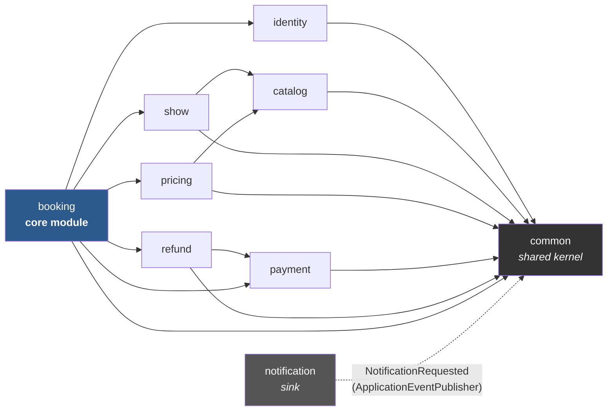
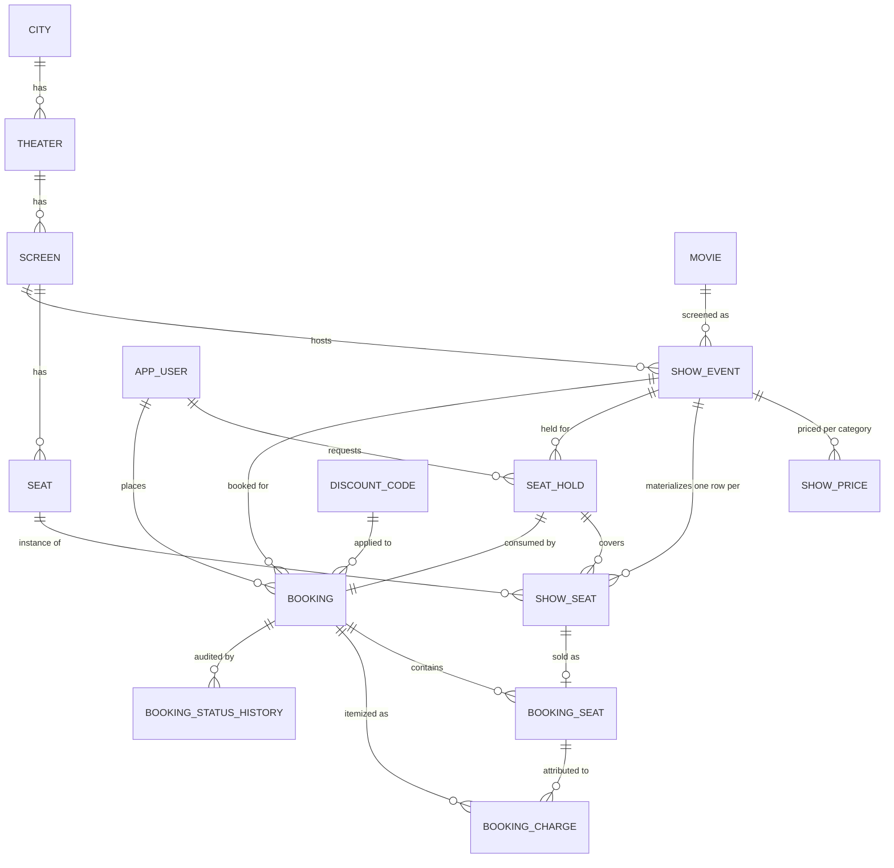
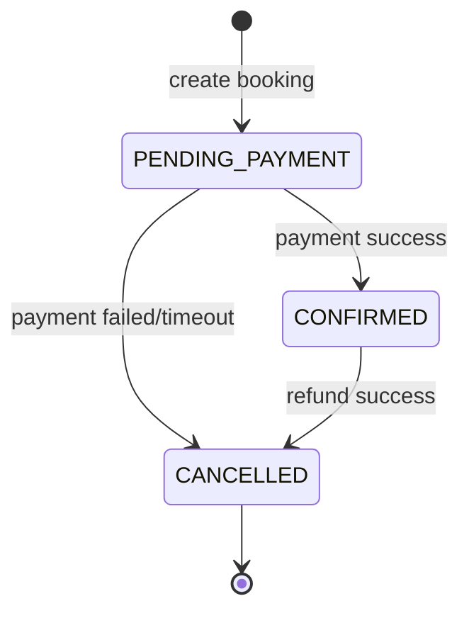

# CineAgent

A robust, highly concurrent movie ticket booking system. Built to handle seat-level holds, configurable refund policies, pricing tiers, and discount codes, all with strong concurrency guarantees.

## Quick start

Clone, build, and run in under 30 seconds. Requires JDK 25.

```bash
./mvnw clean package -DskipTests
java -jar target/cineagent-0.0.1-SNAPSHOT.jar
```

The app boots on `localhost:8080`.
An initial dataset (cities, theaters, users, and admin roles) is seeded automatically via Flyway.

## Features

- **Seat-level booking**: Materialized `show_seat` rows, one per `(show, seat)`
- **Time-bound holds**: Auto-release on expiry via `SeatHoldService` lazy expiry + `HoldExpirySweeper`
- **Pricing tiers**: Configurable base prices with regular, premium, and weekend rates
- **Discount codes**: Usage capped, flat or percentage-based
- **Configurable refund policies**: Tiered pro-rata per-seat refunds
- **Concurrency & Seat Locking Guarantee**: Strong serialization for concurrent booking to prevent double-allocation
- **Notifications**: Transactional outbox for async notifications

## Tech stack

- **Java 25 (LTS) + Spring Boot 4.1**
- **Maven**
- **Spring Data JPA + Flyway**
- **H2 in-memory (PostgreSQL compatibility mode)** and **embedded Postgres**
- **Feature-sliced package layout**
- **Spring Security + stateless JWT (HS256), BCrypt**
- **RFC 7807 `ProblemDetail`** for error handling
- **`BigDecimal`** strict usage for all financial math

## Architecture



`notification` depends on nothing — every other module publishes a single generic
`NotificationRequested` event (living in `common`) through Spring's `ApplicationEventPublisher`,
so nothing in the codebase ever imports *from* `notification`.

Cross-module calls only ever go through another module's `service`/`domain`/`dto` layer, never
its `repository`.

## Data model



## The booking and payment lifecycle



## API reference

Full OpenAPI spec is live at `/v3/api-docs` and browsable at `/swagger-ui.html`. Grouped summary:

| Module | Endpoints |
|---|---|
| **Auth** (public) | `POST /auth/register`, `POST /auth/login`, `GET /auth/me` |
| **Catalog** (public browse) | `GET /cities`, `GET /cities/{id}/theaters`, `GET /movies`, `GET /screens/{id}/seats` |
| **Catalog** (admin) | `POST`/`PUT /admin/cities`, `POST`/`PUT /admin/theaters`, `POST /admin/screens`, `POST /admin/screens/{id}/seats/bulk`, `POST`/`PUT /admin/movies` |
| **Shows** (public browse) | `GET /shows`, `GET /shows/{id}`, `GET /shows/{id}/seats` |
| **Shows** (admin) | `POST /admin/shows`, `POST /admin/shows/{id}/cancel` |
| **Seat holds** | `POST /shows/{id}/holds`, `POST /holds/{id}/extend`, `DELETE /holds/{id}` |
| **Seat blocking** (admin) | `POST /admin/show-seats/{id}/block`, `POST /admin/show-seats/{id}/unblock` |
| **Discounts** (admin) | `POST /admin/discounts` |
| **Refund policies** (admin) | `POST /admin/refund-policies` |
| **Bookings** | `POST /bookings`, `POST /bookings/{id}/pay`, `POST /bookings/{id}/cancel-seats`, `POST /bookings/{id}/cancel`, `GET /bookings`, `GET /bookings/{id}`, `GET /bookings/{id}/seats`, `GET /bookings/{id}/charges`, `GET /bookings/{id}/history` |
| **Notifications** (admin) | `GET /admin/notifications`, `POST /admin/notifications/dispatch-now` |
| **Ops** (admin) | `POST /admin/ops/sweep-now`, `POST /admin/ops/remind-now` |

All `/api/v1/admin/**` routes require `ROLE_ADMIN`; everything else requires authentication
except the explicitly public browse endpoints above.

## Testing

```bash
./mvnw test                          # H2 suite
./mvnw verify                        # adds the embedded-Postgres concurrency suite
./mvnw verify -Dpostgres.it.skip=true # skip Postgres explicitly (offline reviewer)
```

The test suite covers:
- **Concurrency & Seat Locking Guarantee**: 4 integration test classes covering single-seat contention, overlapping multi-seat all-or-nothing, reversed-order-request deadlock freedom, and HTTP-level tests proving the loser gets a clean `409` conflict.
- **Money/pricing math**: Unit tests for percentage/flat discounts, capping, and pro-rata seat-level allocations.
- **Booking state machine**: Transitions and constraints.
- **Discount usage-cap logic**: Window boundaries and minimum order conditions.
- **Seat holds**: Exact expiry boundaries.
- **Request validation**: Input validation across REST endpoints.

## The AI workflow

This project was built with Claude Code as the primary development tool, with the workflow itself
treated as part of the submission:

- **`AGENTS.md`** is the vendor-neutral engineering constitution — stack, package layout, the
  concurrency/locking rules, money-handling discipline, error contract, API conventions, testing
  requirements, commit discipline. **`CLAUDE.md`** is a thin pointer to it plus Claude-Code-specific
  tool/subagent wiring, so the constitution itself reads as engineering rigor independent of which
  agent or human is reading it.
- **Skills** (`.claude/skills/`): `spring-boot-conventions`, `flyway-migrations`, `api-contract`,
  `concurrency-testing` — loaded proactively before the relevant class of work, not just
  documentation.
- **Subagents** (`.claude/agents/`): `concurrency-auditor` (hunts four specific traps: a status
  predicate inside a locking query, lock-ordering violations, network calls inside a
  lock-holding transaction, events published pre-commit) and `spring-reviewer` (package
  boundaries, N+1 risk, transaction-boundary correctness) — run against commits touching
  `booking`, `show_seat` locking, or the notification outbox.
- **The architecture plan** (`docs/raw/planning/architecture-plan.md`) is the approved
  phase/commit order, treated as authoritative and not reordered without flagging it.
- All raw files used during development — every assignment PDF considered (only Movie Ticket
  Booking System was built; the other three show what was screened out), and the plan itself —
  are committed under `docs/raw/`, per the brief's explicit requirement.
