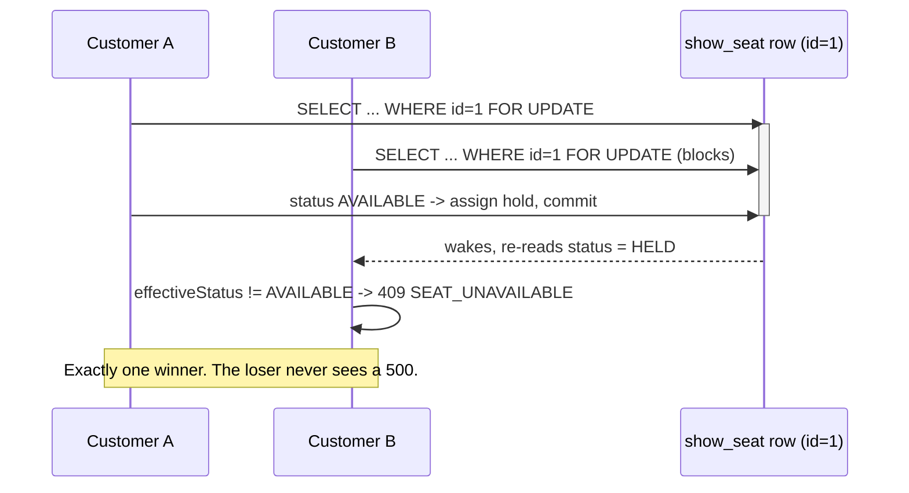
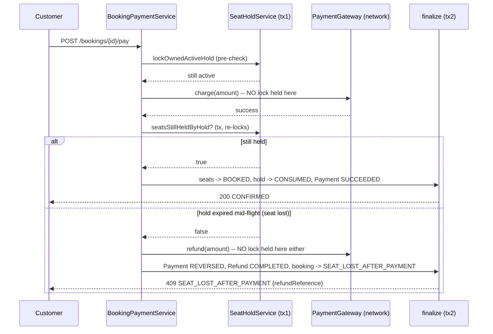
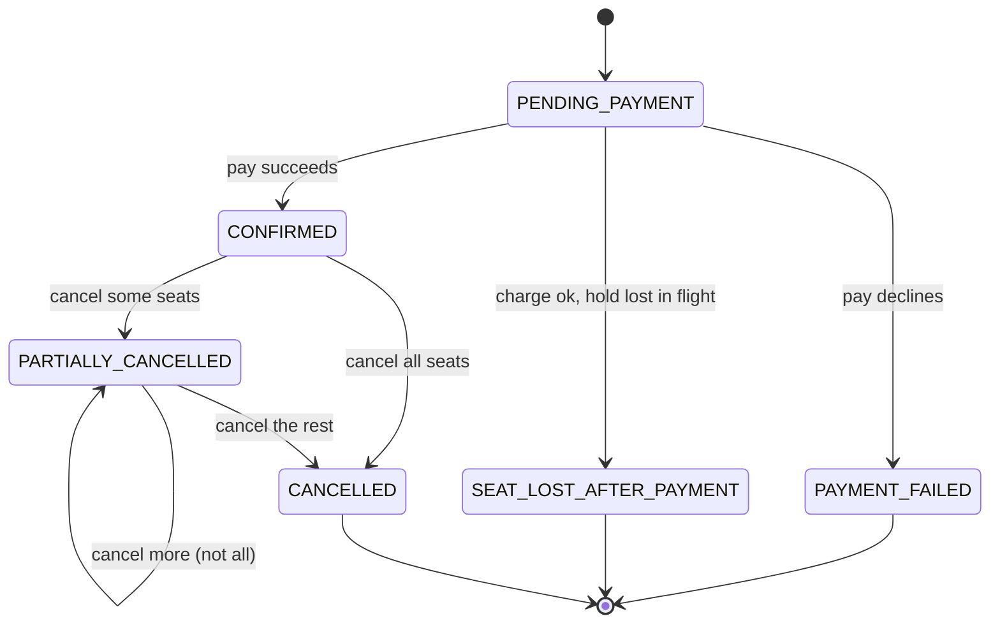

# CineAgent — Workflow Reference

This is the single map of every workflow the system supports: who does it, which endpoints are
involved, what state changes underneath, and what can go wrong. Read `AGENTS.md` first for *why*
the concurrency/money disciplines exist; this document is about *what happens, in what order*.

`scripts/demo.sh` exercises every workflow below against a live running instance — read this
document and the script side by side.

## Actors

- **Admin** (`ROLE_ADMIN`) — manages catalog, shows, pricing, discounts, refund policies, seat
  blocking, and operational triggers. Seeded account: `admin@cineagent.dev` / `Admin@123`.
- **Customer** (`ROLE_CUSTOMER`) — browses, holds seats, books, pays, cancels. Any self-registered
  account, or the seeded `customer@cineagent.dev` / `Customer@123`.
- **Scheduler** — three background jobs, each also triggerable on demand by an admin for a demo:
  hold-expiry sweeper, reminder job, notification dispatcher.

---

## 1. Admin: catalog setup

```
City ──< Theater ──< Screen ──< Seat (physical, category REGULAR/PREMIUM/RECLINER)
Movie (independent)
```

| Step | Endpoint | Notes |
|---|---|---|
| Create city | `POST /api/v1/admin/cities` | `UNIQUE(name, state)` |
| Create theater | `POST /api/v1/admin/theaters` | belongs to a city |
| Create screen | `POST /api/v1/admin/screens` | belongs to a theater |
| Bulk seat layout | `POST /api/v1/admin/screens/{screenId}/seats/bulk` | rows × count × category in **one** call — this is deliberate: "manage seat layouts" is unusable as N individual POSTs. Second call on an already-laid-out screen → `409 SEAT_LAYOUT_ALREADY_EXISTS`. |
| Create movie | `POST /api/v1/admin/movies` | independent of city/theater |

## 2. Admin: show management

`POST /api/v1/admin/shows` — the single richest admin write in the system:

1. Locks the `Screen` row (first of three concurrency mechanisms in this codebase — see
   `AGENTS.md` §4).
2. Scans for any `SCHEDULED` show on the same screen whose `[startsAt, endsAt)` overlaps the
   requested window → `409 SCREEN_OVERLAP` if found.
3. Derives `city` **server-side** from `screen.theater.city` — never accepted from the request, so
   a show can never be inconsistent with its own screen's city.
4. Persists one `ShowPrice` row per seat category in the request body (per-show, per-category —
   a Tuesday matinee and a Friday premiere of the same film price independently).
5. Provisions one `ShowSeat` row per physical seat on that screen, `status=AVAILABLE`. This is
   the materialization that makes the concurrency guarantee possible — see §6.

`POST /api/v1/admin/shows/{id}/cancel` — see §7 (cascades into bulk refund).

## 3. Admin: pricing, discounts, refund policies

- **Pricing** is *not* a separate rule engine — `ShowPrice` (per-show, per-category) already
  expresses "regular/premium/weekend" fully: a Saturday show is just a show with a higher
  `baseAmount` set at creation. A second pricing-rule layer would be equivalent expressive power
  for materially more code, so it was deliberately not built.
- **Discount codes** (`POST /api/v1/admin/discounts`): `PERCENTAGE` or `FLAT`, a redemption cap
  enforced by a conditional `UPDATE ... WHERE used_count < max_redemptions` (a counter race, not
  a resource race — no lock ordering needed), an optional `minOrderAmount` floor and
  `maxDiscountAmount` cap.
- **Refund policies** (`POST /api/v1/admin/refund-policies`): tiered rows keyed on
  `minMinutesBeforeShow` (minutes, not hours — truncation produces off-by-one refunds at every
  boundary), resolved **most-specific-scope-wins**: `SHOW > THEATER > CITY > GLOBAL`. A `GLOBAL`
  3-tier default (100% ≥24h, 50% ≥6h, 0% otherwise) is seeded by `V101__seed_refund_policy.sql` so
  resolution always succeeds even with zero admin-configured overrides.

## 4. Admin: seat blocking

`POST /api/v1/admin/show-seats/{showSeatId}/block` / `.../unblock` — a broken seat or a
press/VIP hold. Only legal from `AVAILABLE → BLOCKED` and back; a customer hold attempt on a
blocked seat gets the same `409 SEAT_UNAVAILABLE` + `conflictingSeats` shape as any other
unavailable seat.

## 5. Customer: browse and hold

```
GET  /api/v1/shows?cityId=&movieId=&from=&to=     — paginated browse, public
GET  /api/v1/shows/{id}                            — one show, public
GET  /api/v1/shows/{id}/seats                       — seat map with live status + price, public
POST /api/v1/shows/{id}/holds        {seatIds}      — acquire, auth required
POST /api/v1/holds/{holdId}/extend                  — reset the TTL clock
DELETE /api/v1/holds/{holdId}                       — release early
```

`acquire` is **all-or-nothing**: if any requested seat is unavailable, no hold is created for
*any* of them, and the `409` body lists exactly which seats and why
(`conflictingSeats: [{showSeatId, seatLabel, status}]`) so the client can re-render without a
second round trip. See §6 for the locking mechanics underneath.

A hold has a TTL (`app.hold.ttl-minutes`, default 5, or 1 under the `demo` profile) and a per-user
cap (`app.hold.max-active-holds-per-user`, default 3) and a per-request seat cap
(`app.hold.max-seats-per-hold`, default 10).

## 6. The concurrency guarantee (how §5's `acquire` actually serializes)

Every `(show, seat)` pair has one pre-created `show_seat` row — availability is the *presence* of
an `AVAILABLE`-status row, never an absence-based anti-join (which would need gap locks or
`SERIALIZABLE`, neither portable across H2 and Postgres).

1. Resolve requested seat ids to `show_seat` row ids via an **ID-only projection** (never an
   entity-hydrating read — see `ShowSeatRepository.findIdsByShowIdAndSeatIdIn`'s javadoc for the
   `ObjectOptimisticLockingFailureException` bug this specifically avoids).
2. Sort those ids **ascending in Java** — the global lock order (`AGENTS.md` §4.4), independent of
   either engine's query planner. Deadlock-freedom depends on this even when the caller's own
   request lists seats in reverse order.
3. Lock them all in one `SELECT ... FOR UPDATE`, single-table, by primary key, **no status
   predicate** — a `WHERE status='AVAILABLE' ... FOR UPDATE` re-evaluates on wake-up under
   `READ_COMMITTED` and can silently return fewer rows than locked.
4. Check each seat's status **in Java, after the lock is held**, re-deriving effective status from
   the injected `Clock` (a `HELD` row whose hold has logically expired is treated as `AVAILABLE`
   right here, under the lock — lazy expiry is the correctness mechanism, not the sweeper).
5. All-or-nothing: any unavailable seat aborts the whole request with the full conflict list.

A `@Version` column on `show_seat` is a second, independent backstop: even if an engine's
`FOR UPDATE` semantics were ever in doubt, the version check makes a second writer fail loudly
(`ObjectOptimisticLockingFailureException` → mapped to `409 SEAT_UNAVAILABLE`) instead of
silently overwriting. Proven on H2 (the shipped default) and Postgres — see
`ConcurrentSeatHoldH2IT` / `ConcurrentSeatHoldPostgresIT` / `ConcurrentSeatHoldHttpIT`.



## 7. Customer: booking, payment, and the seat-lost-after-payment risk

```
POST /api/v1/bookings              {holdId, discountCode?}   -> PENDING_PAYMENT
POST /api/v1/bookings/{id}/pay                                -> CONFIRMED | 402 | SEAT_LOST_AFTER_PAYMENT
POST /api/v1/bookings/{id}/cancel-seats  {bookingSeatIds, reason}
POST /api/v1/bookings/{id}/cancel        (all active seats)
GET  /api/v1/bookings                    (paginated, mine)
GET  /api/v1/bookings/{id}
GET  /api/v1/bookings/{id}/seats
GET  /api/v1/bookings/{id}/charges
GET  /api/v1/bookings/{id}/history
```

**Booking creation** locks the hold's seats (still `HELD`, not yet consumed), prices each seat
from `ShowPrice`, applies a discount if given, and persists an itemized `BookingCharge` per seat:
one `BASE` line plus, if a discount applies, one `DISCOUNT` line allocated *pro-rata by that
seat's base amount* — the last seat absorbs the rounding remainder so the lines always sum
exactly to the total. The discount is redeemed (conditional `UPDATE`) *after* the seat locks, per
the global lock order.

**Payment never runs inside the transaction holding the seat lock** (`AGENTS.md` §4.6). The flow
splits into short transactions around the one network call, via `TransactionTemplate` (not
`@Transactional` self-invocation, which would silently skip the proxy):



This is the ~20-line handler almost nobody writes: the charge can legitimately succeed while the
hold expires in flight (a slow gateway, a customer who paused on a payment page past the hold
TTL) and someone else's request reclaims the seat in between. The customer is made whole
automatically — a refund is issued before the response is returned — and the response carries the
refund reference, not a bare error.

**Payment decline** (`MockPaymentGateway` forces a decline on one magic amount, `13.13`, so the
path is demoable deterministically): the booking moves to `PAYMENT_FAILED`, a `FAILED` `Payment`
row is recorded, and — critically — **the seats are left exactly as they were** (`HELD`, still
tied to the original hold). The customer can retry `pay` again within the hold's remaining TTL; no
compensating seat-release is needed because the seats were never taken out of `HELD` in the first
place.

**Partial per-seat cancellation** resolves the literal "book and cancel *seats* (plural)"
requirement: cancelling one seat of a three-seat booking refunds exactly that seat's own `BASE` +
`DISCOUNT` charge lines (never a recomputation from today's prices), released back to
`AVAILABLE`, while the other two stay `BOOKED`. The refund percentage is resolved fresh at
cancellation time from §3's tiered policy, using `Duration.between(now, show.startsAt)`. Same
lock-then-network-call split as payment: seat release + refund-amount computation happen in one
short transaction that commits *before* the refund gateway call.

Booking status is a guarded state machine — illegal transitions (e.g. cancelling an already
`CANCELLED` booking) throw `409 INVALID_BOOKING_STATE` rather than silently no-opping:



Every transition is recorded in `booking_status_history` (append-only), which is also how "view
booking history" is resolved both ways the PDF's phrase could mean: `GET /bookings` is the list of
a customer's past bookings; `GET /bookings/{id}/history` is the lifecycle timeline of one.

## 8. Admin: show cancellation cascade

`POST /api/v1/admin/shows/{id}/cancel` does three things in sequence:

1. `ShowService.cancel` — the show itself moves to `CANCELLED`.
2. Every `CONFIRMED` or `PARTIALLY_CANCELLED` booking on that show is fully cancelled
   (`BookingCancellationService.cancelEntireBooking`), each producing its own refund and its own
   `booking_status_history` entry ("Show cancelled by admin").
3. Each cancellation fans out a `BOOKING_CANCELLED` notification — §9.

This lives in the `booking` module (`AdminShowCancellationService`), not `show`, because `show`
must never depend on `booking` (the dependency rule in `AGENTS.md` §3) — even though the trigger
is a show-level admin action.

## 9. Notifications: transactional outbox

`NotificationRequested` is one generic event in `common.event`, published via
`ApplicationEventPublisher` from wherever a notification-worthy state change happens (payment
confirmation, cancellation, show-cancellation fan-out, reminders). This keeps `notification` a
true sink — nothing in the codebase imports anything *from* it.

`OutboxEventListener` picks the event up via `@TransactionalEventListener(BEFORE_COMMIT)`,
**inside the publisher's own transaction** — never on a plain `@Async` thread, which could
"confirm" a booking whose transaction then rolls back. `UNIQUE(dedupe_key)` gives exactly-once
*production* of the outbox row even if `publishEvent` is somehow called twice for the same
logical event.

`OutboxDispatcher` (`@Scheduled`, also triggerable via `POST /admin/notifications/dispatch-now`)
drains bounded 50-row batches, locked ascending-id (same global lock-order rule as everything
else), with exponential backoff to `DEAD_LETTER` after repeated failures.

`GET /api/v1/admin/notifications?bookingRef=CINE-XXXX` is the observability hook: it turns "trust
me, it's async" into "here's the row" on camera.

**Reminders** (`ReminderService`, `POST /admin/ops/remind-now` to force): a job scans for
`SCHEDULED` shows starting within `app.reminder.lead-time-hours` and enqueues a `SHOW_REMINDER`
notification per `CONFIRMED`/`PARTIALLY_CANCELLED` booking on each. Idempotent by construction:
the dedupe key is `SHOW_REMINDER:{bookingId}:{showStartsAtEpochMilli}`, so a job that fires twice
in the same window produces at most one row per booking.

## 10. Hold expiry: lazy correctness, sweeper is convergence only

> The system must remain correct with the sweeper switched off.

Every code path that touches a `show_seat` row re-derives its *effective* status from the
injected `Clock` before acting (§6 step 4) — this is what makes the no-double-booking guarantee
hold, independent of any background job. `HoldExpirySweeper` (`@Scheduled`, or
`POST /admin/ops/sweep-now`) runs bounded 200-row batches in **separate** transactions purely so
*stored* state converges to reality and an explicit expiry event exists — it is a housekeeping
job, not a correctness mechanism.

## 11. Error contract

RFC 7807 `ProblemDetail` from every endpoint, framework exceptions included (a client should never
see two different error shapes from the same API). Selected codes, by workflow:

| Code | HTTP | Where it fires |
|---|---|---|
| `SEAT_UNAVAILABLE` | 409 | hold acquisition, any requested seat not `AVAILABLE` |
| `HOLD_EXPIRED` | 409 | booking creation / payment / extend on a hold past its TTL or already released |
| `HOLD_NOT_FOUND` | 404 | operating on someone else's hold (404, not 403 — existence isn't leaked) |
| `HOLD_LIMIT_EXCEEDED` | 422 | per-request seat cap or per-user active-hold cap |
| `SEAT_LOST_AFTER_PAYMENT` | 409 | charge succeeded, hold expired in flight — response carries `refundReference` |
| `INVALID_BOOKING_STATE` | 409 | illegal `BookingStatus` transition (double-cancel, pay on a non-pending booking) |
| `BOOKING_NOT_FOUND` | 404 | booking doesn't exist, or belongs to another user |
| `SEAT_NOT_IN_BOOKING` | 422 | `cancel-seats` referencing seats not on / not active on this booking |
| `SHOW_NOT_BOOKABLE` | 422 | show outside its sales window, or (booking creation) no price configured for a seat's category |
| `SCREEN_OVERLAP` | 409 | admin show creation overlapping an existing show on the same screen |
| `SEAT_LAYOUT_ALREADY_EXISTS` | 409 | bulk seat layout POSTed twice on the same screen |
| `DISCOUNT_INVALID` | 422 | unknown code, inactive, or outside its validity window |
| `DISCOUNT_EXHAUSTED` | 422 | redemption cap already hit (conditional-UPDATE race loser too) |
| `DISCOUNT_MIN_ORDER_NOT_MET` | 422 | order subtotal below the code's `minOrderAmount` |
| `PAYMENT_FAILED` | 402 | gateway declined the charge |
| `INVALID_CREDENTIALS` | 401 | login |
| `EMAIL_ALREADY_REGISTERED` | 409 | registration |
| `VALIDATION_FAILED` | 400 | bean-validation failure on any request body |
| `INTERNAL_ERROR` | 500 | anything unmapped — the floor, not a workflow outcome |

Five `ErrorCode` entries (`SEAT_CONTENTION_TIMEOUT`, `IDEMPOTENCY_KEY_REUSE`,
`REQUEST_IN_PROGRESS`, `IDEMPOTENCY_KEY_REQUIRED`, `PAYMENT_ALREADY_EXISTS`,
`REFUND_NOT_ALLOWED`, `REFUND_ALREADY_EXISTS`) are **reserved but not currently thrown anywhere**
— they were provisioned for an idempotency-key mechanism on booking/payment creation that was
scoped out under the time budget. Double-payment is instead prevented structurally: payment only
ever fires from `PENDING_PAYMENT`, and a successful charge immediately transitions the booking
away from that state, so a retried `pay` call on an already-`CONFIRMED` booking hits
`INVALID_BOOKING_STATE` before it could ever reach the gateway a second time. This is weaker than
a real `Idempotency-Key` header (a network retry of the *first* `pay` attempt, arriving before the
transition commits, is not deduplicated) — noted here rather than silently left unstated.

## 12. Running the whole thing

```bash
./mvnw spring-boot:run                          # default H2 profile, zero external deps
./mvnw spring-boot:run -Dspring-boot.run.profiles=demo   # 1-minute hold TTL, 5s sweep interval
./scripts/demo.sh                                # every workflow above, against the live app
```

`mvn test` — H2 suite, no network. `mvn verify` — adds the embedded-Postgres concurrency suite
(`-Dpostgres.it.skip=true` to opt out offline). Swagger UI at `/swagger-ui.html`.
